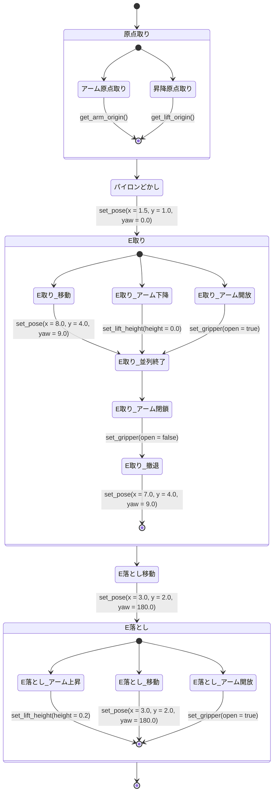

```mermaid
stateDiagram-v2

[*] --> 原点取り

state 原点取り {
    [*] --> アーム原点取り
    [*] --> 昇降原点取り

    アーム原点取り --> [*] : get_arm_origin()
    昇降原点取り --> [*] : get_lift_origin()
}

原点取り --> パイロンどかし
パイロンどかし --> E取り : set_pose(x = 1.5, y = 1.0, yaw = 0.0)

state E取り {
    [*] --> E取り_移動
    [*] --> E取り_アーム下降
    [*] --> E取り_アーム開放

    E取り_移動 --> E取り_並列終了 : set_pose(x = 8.0, y = 4.0, yaw = 9.0)
    E取り_アーム下降 --> E取り_並列終了 : set_lift_height(height = 0.0)
    E取り_アーム開放 --> E取り_並列終了 : set_gripper(open = true)

    E取り_並列終了 --> E取り_アーム閉鎖
    E取り_アーム閉鎖 --> E取り_撤退 : set_gripper(open = false)
    E取り_撤退 --> [*] : set_pose(x = 7.0, y = 4.0, yaw = 9.0)
}

E取り --> E落とし移動
E落とし移動 --> E落とし : set_pose(x = 3.0, y = 2.0, yaw = 180.0)

state E落とし {
    [*] --> E落とし_アーム上昇
    [*] --> E落とし_移動
    [*] --> E落とし_アーム開放

    E落とし_アーム上昇 --> [*] : set_lift_height(height = 0.2)
    E落とし_移動 --> [*] : set_pose(x = 3.0, y = 2.0, yaw = 180.0)
    E落とし_アーム開放 --> [*] : set_gripper(open = true)
}

E落とし --> [*]
```